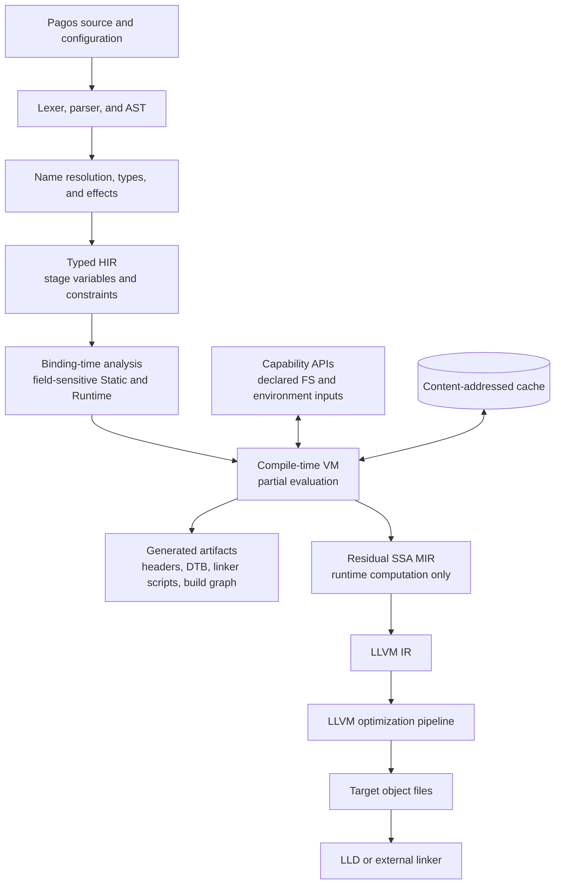

# Compiler Architecture

Status: Milestones 1 and 2 core baselines implemented; see the
[Milestone 2 summary](milestone-2.md) for scope and deferred work. The broader
component design below also includes future systems and build capabilities.

## Design boundary

LLVM is responsible for optimizing and generating the residual runtime program.
It is not responsible for Pagos binding-time inference, effect checking,
compile-time execution, or stage diagnostics.

Pagos-specific semantics must be resolved before lowering to LLVM IR.

## Milestone 1 implementation baseline

The reference compiler uses C++26, CMake, and LLVM 22. Its populated modules
mirror the repository layout: source management, syntax, semantic typing, typed
HIR, stage analysis, the compile-time evaluator, and LLVM code generation are
separate libraries. The AST contains syntax and spans only; an independent type
table feeds stage analysis.

Milestone 1 initially lowered residual typed HIR directly to LLVM IR as a
vertical-slice shortcut. The first Milestone 2 slice replaces that shortcut
with the residual SSA MIR boundary shown below. No LLVM IR types or values
appear in syntax, semantic, HIR, evaluator, or MIR interfaces. The private
integer implementation may use LLVM Support/ADT (`APInt`); binding-time rules,
checked-operation diagnostics, and target semantics remain Pagos-owned.

M3 preparation separates source annotations (`syntax::Type`) from semantic
facts (`sema::Type`) and concrete residual descriptors (`mir::Type`). Semantic
and MIR integers carry width/signedness, arrays carry a scalar element type
and length, and record fields retain ordered types plus nominal identity.
Deferred semantic lengths and error/unknown types cannot become valid MIR.
Source syntax still admits only the M2 subset; representation support does
not enable additional language types or generalize every MIR operation.

`IntegerValue` stores up to 64 bits inline and delegates checked arithmetic
to a private APInt adapter. Wider values are rejected explicitly. Existing
M2 constant payloads remain compact u32/bool vectors; their evaluator ingress
uses the integer adapter. Multi-width constant payload admission and signed
source-language rules belong to M3. Shared constant equality, hashing, scalar
conversion, and printing preserve nominal record identity and scalar types.

HIR nodes are shared immutable computations, but their `Constant` payloads
are currently owned values. Specialization keys copy argument payloads;
Sequence construction and HIR-to-MIR constant emission can also copy vectors.
No constant pool, shared aggregate payload, or arena migration is introduced
without a measured benefit. This is an explicit remaining optimization point,
not a claim of zero-copy evaluation.

`codegen::TargetConfig` carries the triple, CPU, and feature string for each
emission session. `TargetLayout` obtains DataLayout from LLVM TargetMachine
and queries pointer width, allocation size, ABI alignment, and record field
offsets. Layout and LLVM emission share one private storage-type conversion.
No target-specific layout cache is global, and board MMIO addresses remain
outside the compiler. A storage layout is not a C ABI argument/return
classification; target ABI lowering remains M3 work.



## Components

### 1. Source manager and diagnostics

Own source buffers, stable spans, line maps, macro/generated-source provenance,
and structured diagnostics. Stage dependency paths must retain source locations
through every IR.

### 2. Lexer and parser

Begin with a hand-written lexer and recursive-descent/precedence parser. The
grammar should remain intentionally small until staging behavior is proven.

The AST represents syntax only. It should not own symbol resolution, inferred
types, or LLVM values.

### 3. Semantic analysis

Perform:

- module and name resolution;
- type checking and inference;
- effect checking;
- construction of generic constraints;
- collection of explicit `static` and `runtime` constraints.

Do not emit LLVM IR from the AST.

### 4. Typed HIR

HIR preserves source-level structure while making types, symbols, effects, and
stage variables explicit. It is the main representation for high-quality
language diagnostics.

Important HIR concepts include:

- stage variables and constraints;
- effect sets;
- typed aggregate fields;
- function calls before specialization;
- explicit runtime roots;
- structured Runtime ranges and residual sequencing;
- compile-time capability operations.

The current scalar/array HIR is a shared expression graph. `Reference` nodes
attach use-specific diagnostic paths without cloning the referenced computation;
loop indices and Runtime reads keep their original identity through aliases
and calls. `Sequence` records ordered residual evaluations plus a result whose
value stage may still be Static. Statement and argument evaluations are
retained even when their values are unused. MIR reuses an already lowered
value only where its definition dominates the use. `emit-hir` includes a
`residual =` line for sequenced entry work, including top-level loops; repeated
textual expressions can denote shared nodes rather than repeated evaluations.

Static-index array projection follows `Reference` nodes and the result of a
`Sequence` to an `Array` construction. It selects that element's stage and
rebases diagnostic alias/parameter steps onto that element's Runtime source.
Folding emits a `Sequence` of the original array/index work and a fresh scalar
constant, preserving identity and all earlier evaluations. Explicit
`RuntimeBoundary`, Runtime `If`, and `ReturnScope` nodes are opaque: projection
does not infer Static values across Runtime selection or compare branches.

HIR records whether an expression can continue and whether it may return from
the enclosing call. `Return` carries the return value; `ReturnScope` delimits
an inlined call with residual returns. Statically resolved returns disappear
during analysis. MIR lowering routes residual returns to a per-call exit and
merges their values with a phi. Terminated paths contribute neither an `if`
continuation nor a loop backedge. The type side table uses an internal `never`
type for expressions that always return, so they need no continuation value.

### 5. Binding-time analysis

Solve the `Static <= Runtime` constraints, preserving field and value
precision. Record explanation edges so every Runtime result can identify its
origin and every failed `static` requirement can show a thaw path.

This phase determines which regions are executable by the compile-time VM and
which require symbolic/residual values.

### 6. Compile-time VM and partial evaluator

The first implementation should use a tree/bytecode interpreter rather than
LLVM JIT. Priorities are:

- deterministic behavior;
- precise source-level stack traces;
- configurable fuel and memory limits;
- target-correct scalar semantics;
- capability enforcement;
- dependency recording;
- symbolic values for residualization.

ORC JIT can later accelerate pure, closed, frequently evaluated functions. It
must not become the semantic reference implementation.

The evaluator produces both concrete static values and residual operations.
Static values crossing the boundary are checked for embeddability.

The current evaluator supports bounded Static recursion and memoizes pure,
fully Static results. `AnalysisLimits` controls fuel, recursion depth, and the
number of specializations; `AnalysisStats` exposes consumption, cache hits, and
maximum depth. Runtime recursion and full host-memory accounting remain future
work.

Array generators retain bound expressions in compact AST nodes through type
checking, without per-element AST expansion. The semantic type table retains
literal lengths where known and uses length zero for deferred scalar-array
shapes (`[u32; ?]` / `[bool; ?]` in diagnostic text). Zero is not a valid source
array length or a MIR value type. Analysis evaluates the bounds per invocation
and creates concrete HIR types without mutating the shared semantic table.
It rechecks deferred shape constraints at bindings, call arguments, explicit
returns, function tails, and Runtime branch joins before MIR lowering.
Source signatures remain fixed-length, not dependent types.

After bound evaluation, analysis reserves cumulative quotas before allocating the
element vector, then charges fuel per iteration and analyzes the scoped body.
Bound effects wrap the constructed result in a Sequence, preserving early exits,
reads, traps, and argument work on cache hits. Bound evaluation itself uses the
ordinary fuel, recursion, specialization, and construction budgets.
Both generators and literals use the same HIR array construction path, so
embedding, per-element staging, effects, and residual returns remain shared.
Quota checks use remaining capacity and division before multiplication to
avoid overflow; counters reset for each analysis. These quotas do not measure
HIR overhead, cache copies, or backend allocations.

The CRC-32 demonstration exercises this path with recursive Static table
construction and residual checked lookups. `u32` bitwise operators preserve
the same stages and sequencing as other strict primitives. MIR names shifts
`shl.checked` / `lshr.checked`; LLVM lowering guards Runtime counts before
shifting to avoid poison. Right shift is logical, and no overflow/exact flags
are attached. Known valid counts need no residual guard. See the
[CRC walkthrough](crc32.md) for the differential test and current scope.

Minimal record declarations retain only source names and explicit scalar types
in AST. Inferred expression types remain in semantic side tables. HIR carries
record schemas and canonical declaration-order field operands; a Sequence
preserves source-order initializer work, with shared identities preventing
duplicate execution. Field projection looks through aliases and sequences,
but not Runtime boundaries, conditionals, or call return joins. Portable
constants in `include/pagos/value.h` carry nominal record names and typed
scalar fields; specialization keys hash their contents, not host pointers.

Shared aggregate reservations count scalar members and logical payload bytes
for arrays and records. Remaining-capacity checks precede sums/products and
member-vector allocation. Records count declared boolean and integer fields;
array checks compose atomically with existing array-only quotas. An exhausted
construction budget suppresses subsequent construction-budget errors until the
next analysis. Statistics count successful reservations, including ones whose
evaluation later exits early, not live heap allocations. Constant/key copies,
record schema storage, and backend allocations remain outside these quotas.

### 7. Residual SSA MIR

MIR contains only target-runtime work. It should be small, typed, target-aware,
and convenient to verify and lower.

The current MIR has explicit basic blocks, SSA values, typed operations,
conditional and unconditional branches, phi nodes, range-loop backedges,
checked division, remainder, array construction and indexing, and returns.
Array types carry scalar element kind and fixed length; constants and
specialization keys contain array values, never host addresses. The verifier
checks array lengths, element types, index types, and operand dominance.
LLVM lowers known tables to deduplicated private read-only globals. Dynamic
array values use SSA aggregates; dynamic indexing uses entry-block storage
reused across loop iterations. Bounds checks precede address calculation and
loads; failure calls `llvm.trap`. MIR verification also rejects invalid
types, undefined values, unreachable blocks, incomplete phi inputs, and
non-dominating uses before LLVM lowering. `pagosc emit-mir` provides a stable
textual form for golden tests.

Record construction and constant-field projection are explicit MIR operations.
Nominal record types include ordered scalar field kinds; verification rejects
inconsistent definitions, malformed constants, wrong field types/counts,
out-of-range projections, non-dominating operands, and incompatible phi inputs.
LLVM uses unpacked struct values with `insertvalue`, `extractvalue`, and struct
phis. This internal representation is not a source-level layout or C ABI
contract. Record values do not require heap allocation.

Initial operations should cover:

- constants and arithmetic;
- blocks, branches, and phi/block parameters;
- function calls and returns;
- stack/global storage;
- loads, stores, and volatile operations;
- address calculation;
- embedded constants and symbol relocations.

MIR is also the right level for Pagos-specific size reports and simple cleanup
passes before LLVM lowering.

### 8. LLVM backend

Lower MIR to LLVM IR with an explicit target triple, data layout, CPU, and
features. Use LLVM's supported optimization pipeline and target machine APIs to
produce assembly or object files.

Pin one tested LLVM release series in CI. Do not depend on LLVM trunk APIs for
the initial compiler.

LLD may be embedded or invoked as an external linker. Supporting an external
linker first keeps the compiler smaller and works better with vendor toolchains.

### 9. Artifact generation

Configuration libraries should produce typed intermediate data first, followed
by explicit emitters for formats such as:

- C headers and source files;
- static device initialization tables;
- linker scripts and memory maps;
- DTS/DTB and Zephyr overlays;
- Kconfig fragments when integrating with existing projects;
- Ninja-compatible build graphs.

Artifact generation is not LLVM code generation and should remain a separate
library layer.

### 10. Build graph executor

Compile-time Pagos code constructs a declarative graph of commands, files,
tools, environments, and outputs. A separate executor schedules actions and
maintains a content-addressed cache.

This prevents arbitrary command execution from contaminating language
evaluation and makes build dependencies inspectable.

## Recommended repository layout

```text
pagos/
  CMakeLists.txt
  docs/
  include/pagos/
    source/
    syntax/
    sema/
    hir/
    stage/
    vm/
    mir/
    codegen/
  lib/
    source/
    syntax/
    sema/
    hir/
    stage/
    vm/
    mir/
    codegen/
  tools/
    pagosc/
  runtime/
    core/
  std/
    core/
    build/
    embedded/
  tests/
    syntax/
    sema/
    stage/
    vm/
    mir/
    codegen/
    integration/
```

This is a target layout, not a request to create empty directories before they
have code.

## Interoperability strategy

### Runtime call and effect migration contract

The following is a preparation contract, not implemented call/FFI syntax.
MIR already owns a function list, but lowering still produces the single
`pagos_main` entry and inlines Pagos calls through HIR ReturnScope. M3 should
extend `mir::Function` with typed parameters and calling convention, introduce
stable module-local symbol identities and call operands/results, and teach
the verifier to check argument/result types and symbol definitions. The
code generator must create declarations before emitting bodies. Do not infer
aggregate C ABI classification from storage layout alone.

Ordinary external calls are Runtime and conservatively effectful unless a
separate, explicit compile-time capability exists. A Static address never
licenses evaluating, removing, merging, or caching a volatile/MMIO read or
write. Future target addresses must be target-width values or symbolic
relocations, never dereferenceable host pointers. Unsafe permissions and
alias rules remain language work for M3; no host execution of target code
is introduced by layout preparation.

The current `hir::has_residual_work` and `hir::is_cacheable_result` predicates
are shared entry points: a Static result can retain Runtime work, trapping
operations, or return control. Cache hits still evaluate arguments in source
order, including unused arguments, and only pure completed constant results
are memoized. MIR's dominance-aware reuse of the same computation identity
is distinct from proving that two separate effectful operations are equal.
Specialization caches currently reset per analysis; any future cross-session
cache containing target-dependent facts must include target configuration
in its identity. These boundaries precede adding a richer effect model.

### ABI sequence

1. Emit and consume C ABI symbols.
2. Support manually declared C functions and layout-compatible records.
3. Add a Clang-based binding generator or consume a stable generated format.
4. Use C shims for C++ libraries.
5. Consider direct C++ ABI integration only after exceptions, RTTI, overloads,
   templates, mangling, and ABI-version policy have explicit designs.

## MLIR decision

Do not use MLIR for the MVP. A custom HIR and MIR minimize infrastructure while
the semantics are changing.

Reconsider MLIR if Pagos develops several stable transformation domains -- for
example stage IR, device graph IR, build graph IR, and runtime IR -- that need
independent verification and lowering pipelines.
