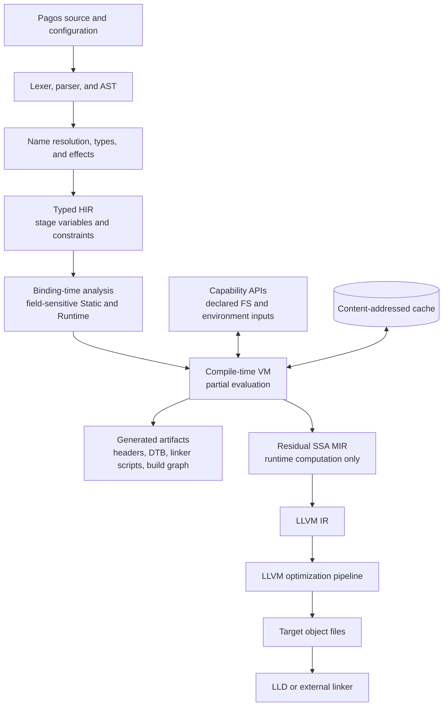

# Compiler Architecture

Status: Milestone 1 implemented. Milestone 2 is in progress with the residual
SSA MIR boundary implemented; later Milestone 2 components remain proposed.

## Design boundary

LLVM is responsible for optimizing and generating the residual runtime program.
It is not responsible for Pagos binding-time inference, effect checking,
compile-time execution, or stage diagnostics.

Pagos-specific semantics must be resolved before lowering to LLVM IR.

## Milestone 1 implementation baseline

The reference compiler uses C++26, CMake, and LLVM 22. Its populated modules
mirror the repository layout: source management, syntax, semantic typing, typed
HIR, stage analysis, the compile-time evaluator, and LLVM code generation are
separate libraries. The AST contains syntax and spans only; an independent type
table feeds stage analysis.

Milestone 1 initially lowered residual typed HIR directly to LLVM IR as a
vertical-slice shortcut. The first Milestone 2 slice replaces that shortcut
with the residual SSA MIR boundary shown below. No LLVM values or APIs appear
in the AST, type checker, stage analyzer, evaluator, or MIR lowering layer.



## Components

### 1. Source manager and diagnostics

Own source buffers, stable spans, line maps, macro/generated-source provenance,
and structured diagnostics. Stage dependency paths must retain source locations
through every IR.

### 2. Lexer and parser

Begin with a hand-written lexer and recursive-descent/precedence parser. The
grammar should remain intentionally small until staging behavior is proven.

The AST represents syntax only. It should not own symbol resolution, inferred
types, or LLVM values.

### 3. Semantic analysis

Perform:

- module and name resolution;
- type checking and inference;
- effect checking;
- construction of generic constraints;
- collection of explicit `static` and `runtime` constraints.

Do not emit LLVM IR from the AST.

### 4. Typed HIR

HIR preserves source-level structure while making types, symbols, effects, and
stage variables explicit. It is the main representation for high-quality
language diagnostics.

Important HIR concepts include:

- stage variables and constraints;
- effect sets;
- typed aggregate fields;
- function calls before specialization;
- explicit runtime roots;
- compile-time capability operations.

### 5. Binding-time analysis

Solve the `Static <= Runtime` constraints, preserving field and value
precision. Record explanation edges so every Runtime result can identify its
origin and every failed `static` requirement can show a thaw path.

This phase determines which regions are executable by the compile-time VM and
which require symbolic/residual values.

### 6. Compile-time VM and partial evaluator

The first implementation should use a tree/bytecode interpreter rather than
LLVM JIT. Priorities are:

- deterministic behavior;
- precise source-level stack traces;
- configurable fuel and memory limits;
- target-correct scalar semantics;
- capability enforcement;
- dependency recording;
- symbolic values for residualization.

ORC JIT can later accelerate pure, closed, frequently evaluated functions. It
must not become the semantic reference implementation.

The evaluator produces both concrete static values and residual operations.
Static values crossing the boundary are checked for embeddability.

### 7. Residual SSA MIR

MIR contains only target-runtime work. It should be small, typed, target-aware,
and convenient to verify and lower.

The current MIR has explicit basic blocks, SSA values, typed operations,
conditional and unconditional branches, phi nodes, checked division and
remainder, and returns. Its verifier rejects invalid types, undefined values,
unreachable blocks, incomplete phi inputs, and non-dominating uses before LLVM
lowering. `pagosc emit-mir` provides a stable textual form for golden tests.

Initial operations should cover:

- constants and arithmetic;
- blocks, branches, and phi/block parameters;
- function calls and returns;
- stack/global storage;
- loads, stores, and volatile operations;
- address calculation;
- embedded constants and symbol relocations.

MIR is also the right level for Pagos-specific size reports and simple cleanup
passes before LLVM lowering.

### 8. LLVM backend

Lower MIR to LLVM IR with an explicit target triple, data layout, CPU, and
features. Use LLVM's supported optimization pipeline and target machine APIs to
produce assembly or object files.

Pin one tested LLVM release series in CI. Do not depend on LLVM trunk APIs for
the initial compiler.

LLD may be embedded or invoked as an external linker. Supporting an external
linker first keeps the compiler smaller and works better with vendor toolchains.

### 9. Artifact generation

Configuration libraries should produce typed intermediate data first, followed
by explicit emitters for formats such as:

- C headers and source files;
- static device initialization tables;
- linker scripts and memory maps;
- DTS/DTB and Zephyr overlays;
- Kconfig fragments when integrating with existing projects;
- Ninja-compatible build graphs.

Artifact generation is not LLVM code generation and should remain a separate
library layer.

### 10. Build graph executor

Compile-time Pagos code constructs a declarative graph of commands, files,
tools, environments, and outputs. A separate executor schedules actions and
maintains a content-addressed cache.

This prevents arbitrary command execution from contaminating language
evaluation and makes build dependencies inspectable.

## Recommended repository layout

```text
pagos/
  CMakeLists.txt
  docs/
  include/pagos/
    source/
    syntax/
    sema/
    hir/
    stage/
    vm/
    mir/
    codegen/
  lib/
    source/
    syntax/
    sema/
    hir/
    stage/
    vm/
    mir/
    codegen/
  tools/
    pagosc/
  runtime/
    core/
  std/
    core/
    build/
    embedded/
  tests/
    syntax/
    sema/
    stage/
    vm/
    mir/
    codegen/
    integration/
```

This is a target layout, not a request to create empty directories before they
have code.

## Interoperability strategy

1. Emit and consume C ABI symbols.
2. Support manually declared C functions and layout-compatible records.
3. Add a Clang-based binding generator or consume a stable generated format.
4. Use C shims for C++ libraries.
5. Consider direct C++ ABI integration only after exceptions, RTTI, overloads,
   templates, mangling, and ABI-version policy have explicit designs.

## MLIR decision

Do not use MLIR for the MVP. A custom HIR and MIR minimize infrastructure while
the semantics are changing.

Reconsider MLIR if Pagos develops several stable transformation domains -- for
example stage IR, device graph IR, build graph IR, and runtime IR -- that need
independent verification and lowering pipelines.
